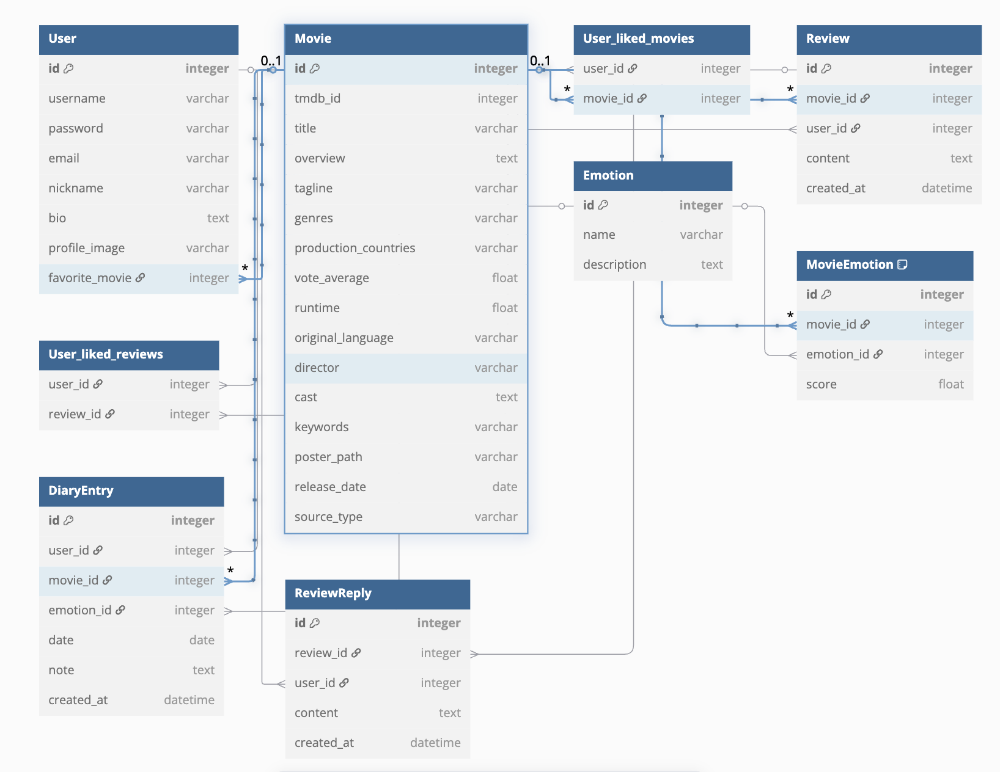

# 🎬 CLOU : 감정 기반 영화 추천 & 다이어리 서비스

## 📌 프로젝트 소개  
**CLOU(끌루)** 는 감정 기반 영화 탐색과 감정 다이어리 기능을 결합한 개인화 영화 추천 웹 서비스입니다.  
사용자는 다양한 감정(기쁨, 슬픔, 고독 등)에 따라 영화를 탐색하고, 감정 다이어리를 작성하며 자신만의 인생 영화를 설정할 수 있습니다.  
Spotify를 통한 OST 미리듣기, 영화 리뷰, 찜하기 등 소셜 기능도 함께 제공합니다.

---

## ✅ 주요 기능  
- **감정 기반 영화 추천**: 감정 버튼을 통해 맞춤 영화 탐색  
- **감정 다이어리**: 감정과 함께 일기 작성, 영화와 연동  
- **영화 찜하기 / 인생 영화 설정**: 내가 좋아하는 영화, 인생 영화 관리  
- **영화 리뷰 / 댓글**: 리뷰 작성, 좋아요, 답글  
- **Spotify 연동**: 영화 OST 미리듣기  
- **프로필 관리**: 닉네임, 프로필 이미지, 자기소개 등  

---

## 🛠 사용 기술 및 개발 도구  

### 프론트엔드  
- **Vue 3.5.13** (Composition API)  
- **Vue Router 4.5.0**  
- **Pinia 3.0.1** (상태 관리)  
- **Axios 1.9.0** (API 통신)  
- **Vite 6.2.4** (빌드 도구)

### 백엔드  
- **Django 4.2.21**  
- **Django REST Framework 3.16.0**  
- **django-allauth / dj-rest-auth** (인증)  
- **django-cors-headers** (CORS)  
- **SQLite3** (개발용 DB)  
- **Spotify API** (OST 연동)

---

## 🧩 데이터베이스 모델링 (ERD)


---

## 📁 폴더 구조
```
clou/
├── clou-back/           # Django 백엔드
│   ├── accounts/        # 사용자 관리 앱
│   ├── movies/          # 영화/리뷰/OST 앱
│   ├── emotions/        # 감정 앱
│   ├── diary/           # 감정 다이어리 앱
│   └── ...
├── clou-front/          # Vue 프론트엔드
│   ├── src/
│   │   ├── components/  # 공통/기능별 컴포넌트
│   │   ├── views/       # 주요 페이지 뷰
│   │   ├── api/         # API 모듈
│   │   └── stores/      # Pinia 스토어
│   └── ...
└── README.md            # 프로젝트 소개 파일
```

---

## 👥 팀원 정보 및 업무 분담

### 이유진  
- **감정 추천 시스템 및 영화 기능 개발 담당**  
- movies, emotions 앱 전체 개발  
- 영화 상세 정보 및 감정 기반 추천 API 구현  
- 감정 버튼 UI 및 프론트 로직 설계  
- 감정 → 영화추천 → 상세 흐름 전반 구현  

### 한선주  
- **마이페이지 및 감정 다이어리 기능 개발 담당**  
- diary, accounts 앱 전체 개발  
- TMDB API 활용 DB 구축  
- 감정 다이어리 UI 및 프론트 로직 설계  
- 내 리뷰 / 찜한 영화 조회 및 프론트 로직 설계  

---

## 🧪 실행 방법

### 1. 백엔드 (Django)
```bash
cd clou-back

# 1. 가상환경 생성 및 활성화
python -m venv venv
source venv/Scripts/activate  # (MacOS: venv/bin/activate)

# 2. 패키지 설치
pip install -r requirements.txt

# 3. DB 마이그레이션
python manage.py migrate

# 4. fixtures 데이터 로드 (영화/감정)
python manage.py loaddata movies/fixtures/movies.json
python manage.py loaddata emotions/fixtures/emotions.json

# 5. 감정-영화 연결 커맨드 실행
python manage.py link_emotions_to_movies

# 6. 서버 실행
python manage.py runserver
```

### 2. 프론트엔드 (Vue)
```bash
cd clou-front
npm install
npm run dev
```

---

## 📊 주요 기능 범위 및 구현 현황

### 🎯 목표한 기능 (기획 단계)

#### Must (필수 구현 대상)
- ✅ 감정 기반 영화 추천
- ✅ 영화 상세 페이지
- ✅ 사용자 인증
- ✅ 리뷰 작성/삭제
- ✅ 영화 찜 기능
- ✅ 프로필 기능
- ✅ 감정 기록 다이어리 기능

#### Should (권장 기능)
- ❌ 감정 히스토리
- ✅ UI 애니메이션 효과
- ❌ 프로필 내 최애 영화 등록

#### Could (선택 기능)
- ❌ 콘텐츠 공유 기능
- ❌ 찜한 콘텐츠 기반 분석 기능
- ❌ 영화 리뷰 기반 뱃지 이벤트 기능

> ✅ 표시는 실제 구현 완료된 기능입니다.

--- 

## 🧠 영화 추천 알고리즘에 대한 기술적 설명

- TMDB API 이용해서 영화 데이터 수집 후,
감정별로 영화를 분류하고 이를 활용해 영화 추천 알고리즘에 이용

---

## 🤖 생성형 AI 를 활용한 부분
- API 를 활용한 데이터를 불러오는데 도움을 받음
- 디버깅 및 코드 최적화에 도움을 받음

---

## 📝느낀점 및 후기
### 이유진
> 이번 프로젝트는 단순한 영화 정보 제공을 넘어, 감정 기반으로 영화를 큐레이션하는 사용자 중심 서비스로 구현하고자 했습니다. Spotify 등 외부 API 데이터를 이용하고 감정 태깅을 통한 영화 분류와 리뷰·찜·OST 기능을 포함한 상세 페이지까지 전반적인 흐름을 기획하고 개발했습니다.
기획 초기에는 색감 기반 탐색도 고려했지만, 구현에 어려움이 있어 조정했기에 아쉬움이 있었습니다. Django와 DRF를 이용한 API 구성, Vue를 활용한 프론트 구현, 인증 등을 직접 다루며 기획-개발-디자인을 모두 경험하며 풀스택 개발자로서 한 걸음 더 나아가는 시간이었습니다.
기능을 구현하는 데 그치지 않고, 사용자가 공감할 수 있는 콘텐츠 구조와 흐름을 설계하는 과정에서 많은 고민과 시도를 할 수 있었고, 그 과정 자체가 큰 성장이었습니다.

### 한선주
 한 학기 동안 배운 내용을 종합적으로 활용해 처음으로 진행한 프로젝트여서 그런지, 아무래도 아쉬움이 많이 남는 프로젝트였습니다. 관통 프로젝트에서는 주어진 명세에 맞춰 기능을 구현하는 데 집중해왔다면, 이번에는 처음부터 기획을 스스로 하는 것이 흥미로우면서도 낯선 경험이었습니다. 기획과 구현 모두에 있어서 올바른 방향으로 나아가고 있는지 확신이 들지 않아, 생각보다 일정 관리가 어렵다고 느꼈습니다.
조금 더 시간이 있었다면 목표했던 만큼의 기능을 구현할 수 있었을 거라는 아쉬움도 남습니다. 특히 회원가입과 로그인 기능을 구현하는 데 예상보다 많은 시간이 소요되었고, 데이터를 받아오는 과정에서도 에러가 자주 발생하여 많은 시간을 소비했습니다. 기능 하나를 개선하려다 기존에 잘 되던 기능까지 무너지는 경험도 여러 번 겪으면서, 전반적인 개발 효율이 떨어졌던 것 같습니다.
하지만 이번 프로젝트를 통해 감정 기반 영화 큐레이션이라는 새로운 시도를 직접 기획하고 구현하며 많은 것을 배웠습니다. 다음 프로젝트에서는 더 체계적으로 계획하고, 여유를 두고 개발할 수 있도록 부족한 부분을 보완해 나가겠습니다.


---

- 개발 서버: http://localhost:5173

---

끌리는 감정, 끌루에 담다 🌿